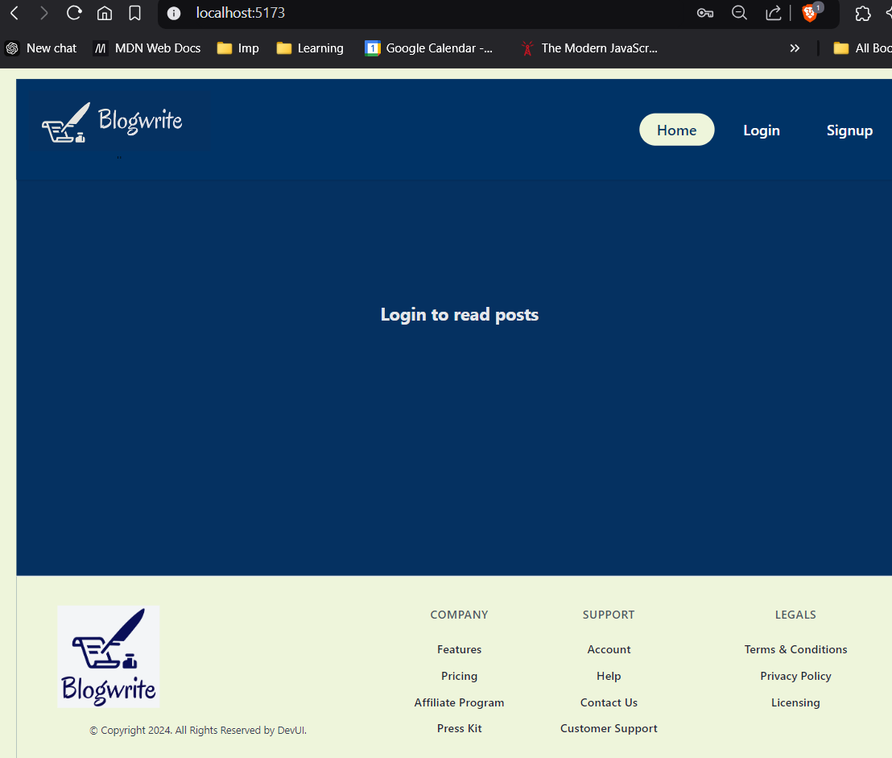
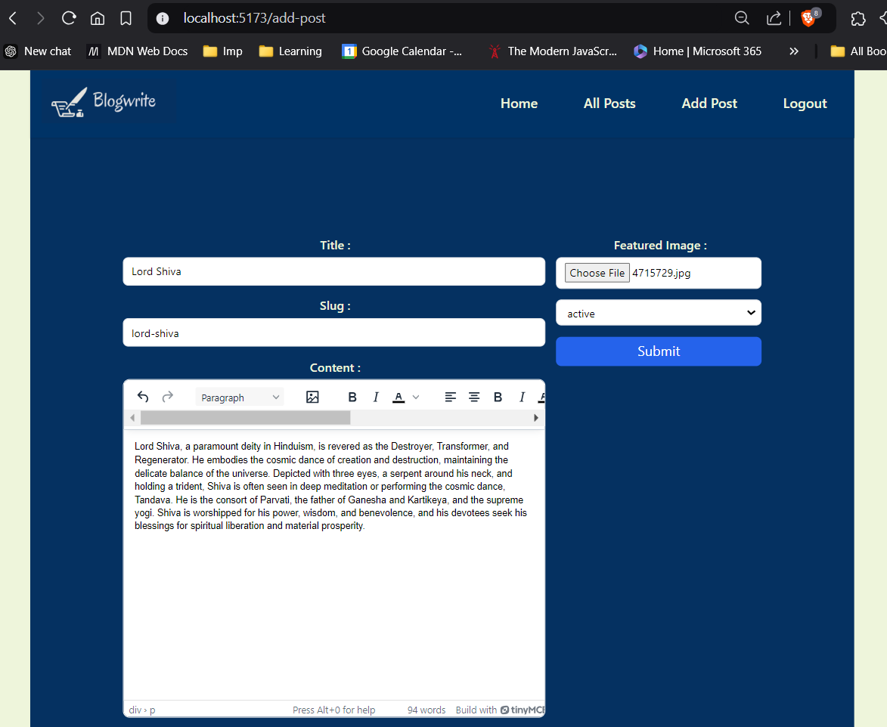

# Blogwrite : A Blog Application

This project is a React-based blog application that leverages modern tools and libraries like Redux Toolkit, React Router, and Appwrite to manage posts, user authentication, and dynamic content creation.


---

## **Features**
- User Authentication (Login and Signup).
- Create, Read, Update, and Delete (CRUD) operations for blog posts.
- Rich text editing for post content using TinyMCE.
- File upload and management for featured images.
- Dynamic slug generation for posts.
- Secure routing for authenticated and unauthenticated users.


## System : Simplified View :


---

## Setup Instructions :
### 1. Clone the repository :
```bash
   git clone https://github.com/imSarthakGautam/Blog_App.git
   cd Blogwrite
   ```

### 2. Installing the dependencies :
```bash
npm i @reduxjs/toolkit react-redux react-router-dom @tinymce/tinymce-react html-react-parser react-hook-form appwrite
```
[About these Packages and dependencies](packages.md)


### 3. Setting up environment variables: 
- Create .env at project root, environment variables being: `env.sample`

### 4.  Using Appwrite Services 
- Register to `Appwrite` and configure account and project settings (Database, bucket ), setup `Appwrite SDK` and  intialize them by setting up endpoints for the project i.e. project Id, database Id.


[More about use of Appwrite Services](appwrite.md)

---

### **Key Features of Routes**
- **`/`**: Home page.
- **`/login`**: Login page for unauthenticated users.
- **`/signup`**: Signup page for new users.
- **`/all-posts`**: Displays all posts for authenticated users.
- **`/add-post`**: Allows creating new posts (authenticated).
- **`/edit-post/:slug`**: Edits an existing post (authenticated).
- **`/post/:slug`**: Displays a single post.

---

## **Usage**
### **Authentication**
- Login and Signup routes use `AuthLayout` to ensure proper user state.
- Authenticated routes (`/all-posts`, `/add-post`, `/edit-post/:slug`) are protected.





### **Dynamic Slug Generation**
- Slugs are auto-generated from post titles during creation and updates.


### **Post Management**
- Rich text content is handled with TinyMCE.
- Featured images are uploaded to Appwrite and linked to posts.



---


